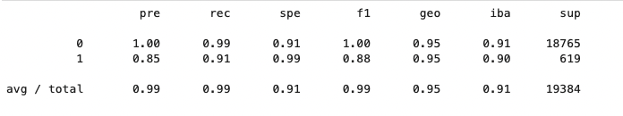
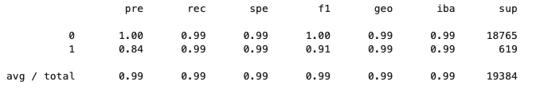

# Credit Risk Analysis 
FinTech Challenge 12 - Credit Risk Analyses Using Logistic Regression On Imbalanced Data

---

## Overview Of Analysis

This is an analysis of credit risk, using a set of imbalanced borrower data to predict "healthiness" of a loan. A healthy loan is one that is likely to be paid, whereas an unhealthy loan is one which has a high risk of default. Because this data set is imbalanced, two [logistical regression]() classifier models will be created. The first will be trained with the original feature data. The second model will be trained with resampled data using the imbalanced-learn [RandomOverSampler](https://imbalanced-learn.org/stable/references/generated/imblearn.over_sampling.RandomOverSampler.html). Each model will then predict the same test data, and the resulting predictions will be compared.  

#### DataSet Details  

A single dataset was used to anlyze this space:
- [lending_data.csv](data/lending_data.csv) containing the following features about borrowers:  
    - contains data: `loan_size | interest_rate | borrower_income | debt_to_income | num_of_accounts | derogatory_marks | total_debt | loan_status`  
    - The `loan_status` column is used as the `y`, or prediction value. With a value of `0` signifying a healthy loan, and a value of `1` signifying an unhealthy loan.
    - NOTE: The `loan_status` column is imbalanced, with significantly more `0` values than `1` values. See counts in table below:  

**Value Counts**
| y (prediction) | ValueCount (Original Data) | ValueCount (Resampled Data) |
| --- | --- | --- |
| `0` | 75036 | 56271 |
| `1` | 2500 | 56271 |  


#### ML Process

1. [lending_data.csv](data/lending_data.csv) split into training and testing sets, with `y` value set from `loan_status` column.
2. A [LogisticRegression](https://scikit-learn.org/stable/modules/generated/sklearn.linear_model.LogisticRegression.html), model will be created and fit with the original training data. This model will then predict using the original test data. This prediction performace will be measured by `balanced_accuracy_score`, `confusion_matrix` and `classification_report`.
3. The original data will be resampled with the [RandomOverSampler](https://imbalanced-learn.org/stable/references/generated/imblearn.over_sampling.RandomOverSampler.html) from the [imbalanced learn](https://imbalanced-learn.org/stable/index.html) module. A second `LogisticRegression` model will be created, trained/fit with this resampled data. Then this resampled model will predict using the same test_data. The resampled model's predictions will be evaluated with the same metrics: `balanced_accuracy_score`, `confusion_matrix` and `classification_report`.
4. The performace metrics for each approach will be compared.  


## Model Evaluation Results  

**Original Data Model**  
The logistic regression model predictions, trained with the original unbalanced data yielded:  
- `0 - recall was .99 with a precision of 1`  
- `1 - recall was .91 with a precision of .85`  
- `.952 balanced accuracy score`


**RandomOverSampler Data Model**  
The logistic regression model predictions, trained with the resampled data yielded:  
- `0 - recall was .99 with a precision of 1`  
- `1 - recall was .99 with a precision of .84`  
- `.993 balanced accuracy score`
  

**Classification Report Original**  
  
**Classification Report Resampled**  
  

See full implementation and notebook details in [credit_risk_resampling.ipynb](app/credit_risk_resampling.ipynb)  

## Summary   

The two models performed similary, although slightly differently depending on the model trained via the original versus the resampled data. Given that of the two predictions, it is more important to find the less common data point, the `1` or unhealthy loan data, as issuing a risky loan which may default is more costly than issuing a healthy loan. Therefore, if there is any tilt, it may be best to prefer the model which does a better job at predicting the `1` values.  

Of the two models, the resampled model has a higer `recall` value of `.99`, compared to the original model which has a recall of `0.91`. This is almost a 10% improvement. Meanwhile the `precision` of the resampled model for the `1` prediction does drop from `0.85` to `0.84`, which is essentially the same precision.  

Therefore, I would recommend using the resampled model, with its higher recall, and nearly identcal precision for the `1` value. Though small, this is an advantage over the model fit with original data.  

---

## Technologies

This challenge uses [python](https://www.python.org/) 3.7 and the following [built-in](https://docs.python.org/3/py-modindex.html) modules:
- [os](https://docs.python.org/3/library/os.html#module-os)
- [pathlib](https://docs.python.org/3/library/pathlib.html)

Additionally, it requires:
- [matplotlib](https://matplotlib.org/)
- [pandas](https://pandas.pydata.org/)
- [JupyterLab](https://jupyterlab.readthedocs.io/en/stable/)
- [scikit-learn](https://scikit-learn.org/stable/index.html)
- [imbalanced-learn](https://pypi.org/project/imbalanced-learn/)

See [installation](#installation) below for specifics.

---

## Installation

You will need Python 3.7, that supports for this application to run. An easy way to install python 3.7 is to download and install [Anaconda](https://www.anaconda.com/products/individual). After installing anaconda, open a terminal/command-prompt, and setup a python 3.7 environment, and then activate it like so:

```
# create an anaconda python 3.7 environment
# name can be any friendly name to refer to your environment, eg 'dev'
conda create --name dev python=3.7 anaconda

# activating the environment
conda activate dev

# use pip to install the above modules, eg:
pip install python-dotenv
...etc...
```


---

## Usage

The analysis is presented within a [JupyterLab](https://jupyterlab.readthedocs.io/en/stable/) notebook. To launch JupyterLab, from the root of this repo dirctory:

```
# within repo root 
$ jupyter lab
```
You can now open and run the notebook [credit_risk_resampling.ipynb](app/credit_risk_resampling.ipynb)  

---

## Contributors

[David Lopez](https://github.com/sububer)

---

## License

MIT